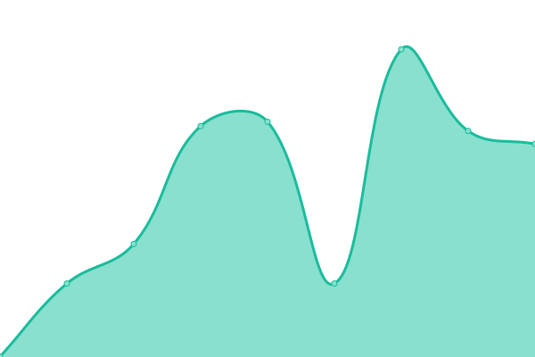
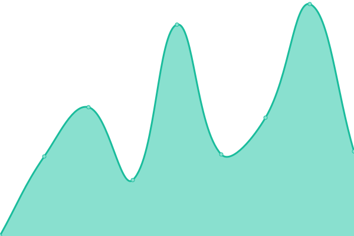
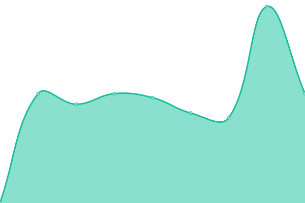
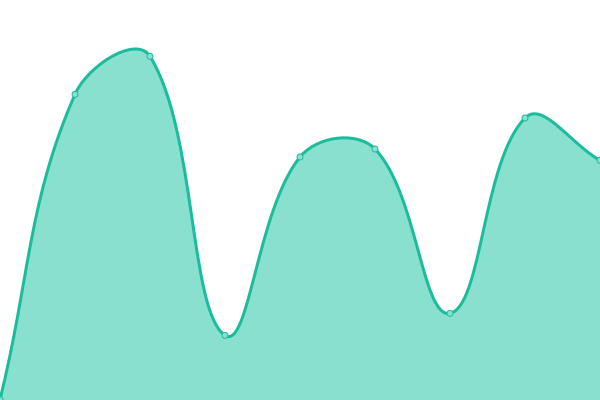
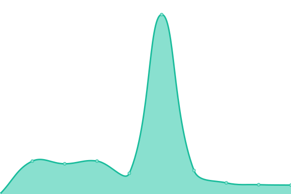

# [📈 Live Status](https://JustWareSRL.github.io/JustWareUpptime): <!--live status--> **🟩 All systems operational**

This repository contains the open-source uptime monitor and status page for [Just Ware SRL](justware.it), powered by [Upptime](https://github.com/upptime/upptime).

With [Upptime](https://upptime.js.org), you can get your own unlimited and free uptime monitor and status page, powered entirely by a GitHub repository. We use [Issues](https://github.com/JustWareSRL/JustWareUpptime/issues) as incident reports, [Actions](https://github.com/JustWareSRL/JustWareUpptime/actions) as uptime monitors, and [Pages](https://JustWareSRL.github.io/JustWareUpptime) for the status page.

<!--start: status pages-->
<!-- This summary is generated by Upptime (https://github.com/upptime/upptime) -->
<!-- Do not edit this manually, your changes will be overwritten -->
<!-- prettier-ignore -->
| URL | Status | History | Response Time | Uptime |
| --- | ------ | ------- | ------------- | ------ |
|  [Just Ware SRL](https://justware.it) | 🟩 Up | [just-ware-srl.yml](https://github.com/JustWareSRL/JustWareUpptime/commits/HEAD/history/just-ware-srl.yml) | 

 583ms
     
 | 

<a href="https://JustWareSRL.github.io/JustWareUpptime/history/just-ware-srl">100.00%</a>
    

|  [CDS System](https://cdssystem.it) | 🟩 Up | [cds-system.yml](https://github.com/JustWareSRL/JustWareUpptime/commits/HEAD/history/cds-system.yml) | 

 1372ms
     
 | 

<a href="https://JustWareSRL.github.io/JustWareUpptime/history/cds-system">100.00%</a>
    

|  [Crowdlanding](https://crowdlanding.it) | 🟩 Up | [crowdlanding.yml](https://github.com/JustWareSRL/JustWareUpptime/commits/HEAD/history/crowdlanding.yml) | 

 264ms
     
 | 

<a href="https://JustWareSRL.github.io/JustWareUpptime/history/crowdlanding">100.00%</a>
    

|  [Delichef](https://delichef.it) | 🟩 Up | [delichef.yml](https://github.com/JustWareSRL/JustWareUpptime/commits/HEAD/history/delichef.yml) | 

 927ms
     
 | 

<a href="https://JustWareSRL.github.io/JustWareUpptime/history/delichef">100.00%</a>
    

|  [DOMOImmobiliare](https://domoimmobiliare.it) | 🟩 Up | [domo-immobiliare.yml](https://github.com/JustWareSRL/JustWareUpptime/commits/HEAD/history/domo-immobiliare.yml) | 

 542ms
     
 | 

<a href="https://JustWareSRL.github.io/JustWareUpptime/history/domo-immobiliare">100.00%</a>
    

|  [Gaiarsa Automobili](https://gaiarsa-automobili.com) | 🟩 Up | [gaiarsa-automobili.yml](https://github.com/JustWareSRL/JustWareUpptime/commits/HEAD/history/gaiarsa-automobili.yml) | 

 392ms
     
 | 

<a href="https://JustWareSRL.github.io/JustWareUpptime/history/gaiarsa-automobili">100.00%</a>
    

|  [Infermento Spirits](https://infermentospirits.it) | 🟩 Up | [infermento-spirits.yml](https://github.com/JustWareSRL/JustWareUpptime/commits/HEAD/history/infermento-spirits.yml) | 

 608ms
     
 | 

<a href="https://JustWareSRL.github.io/JustWareUpptime/history/infermento-spirits">100.00%</a>
    

|  [Mobility Trader HUB](https://mobilitytraderhub.com) | 🟩 Up | [mobility-trader-hub.yml](https://github.com/JustWareSRL/JustWareUpptime/commits/HEAD/history/mobility-trader-hub.yml) | 

 340ms
     
 | 

<a href="https://JustWareSRL.github.io/JustWareUpptime/history/mobility-trader-hub">100.00%</a>
    

|  [Restart Studio](https://restartstudio.it) | 🟩 Up | [restart-studio.yml](https://github.com/JustWareSRL/JustWareUpptime/commits/HEAD/history/restart-studio.yml) | 

 441ms
     
 | 

<a href="https://JustWareSRL.github.io/JustWareUpptime/history/restart-studio">100.00%</a>
    

|  [Veneto Bikers](https://venetobikers.it) | 🟩 Up | [veneto-bikers.yml](https://github.com/JustWareSRL/JustWareUpptime/commits/HEAD/history/veneto-bikers.yml) | 

 612ms
     
 | 

<a href="https://JustWareSRL.github.io/JustWareUpptime/history/veneto-bikers">100.00%</a>
    

<!--end: status pages-->

[**Visit our status website →**](https://JustWareSRL.github.io/JustWareUpptime)

## 📄 License

- Powered by: [Upptime](https://github.com/upptime/upptime)
- Code: [MIT](./LICENSE) © [Anand Chowdhary](https://anandchowdhary.com), supported by [Pabio](https://pabio.com)
- Data in the `./history` directory: [Open Database License](https://opendatacommons.org/licenses/odbl/1-0/)
